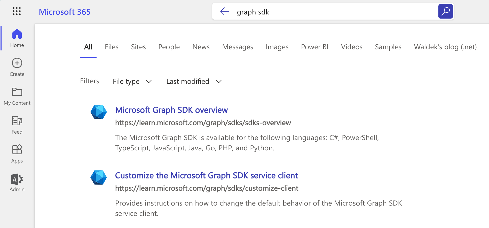

# Ingest local Microsoft Graph docs content using TypeScript on Node.js

## Summary

This sample contains a Microsoft Graph connector that shows how to ingest local Microsoft Graph docs content into Microsoft 365. For each file, it extracts the metadata from front matter, maps them to the external connection's schema and ingests the content retaining the content and metadata. The ingested content is set to be visible to everyone in the organization.

## Contributors

- [Waldek Mastykarz](https://github.com/waldekmastykarz)

## Version history

Version|Date|Comments
-------|----|--------
1.0|July 11, 2024|Initial release

## Prerequisites

- [Microsoft 365 Developer tenant](https://developer.microsoft.com/microsoft-365/dev-program)
- [Node.js LTS](https://nodejs.org)
- [Dev Proxy](https://aka.ms/devproxy) (optional)

## Minimal path to awesome

- Clone this repository (or [download this solution as a .ZIP file](https://pnp.github.io/download-partial/?url=https://github.com/pnp/graph-connectors-samples/tree/main/samples/nodejs-typescript-graphdocs) then unzip it)
- Run the setup script: `./setup.sh`. When finished, it creates information about the Entra app registration in the `src/env.js` file that's excluded from source control
- Install dependencies: `npm i`
- Build the project: `npm run build`
- Create the external connection: `npm run start:createConnection` (this will take several minutes)
- Ingest the content: `npm run start:loadContent`
- Update the result layout:
  - open the [Microsoft 365 admin center](https://admin.microsoft.com)
  - navigate to **Settings** > **Search & intelligence**
  - select **Customizations**
  - from the list of result types, select **msgraphdocs**
  - under **Result layout**, select **Edit**
  - copy the contents of the [result-layout.json](result-layout.json) file and paste them into the **Result layout** editor
  - apply the changes by selecting **Next**
  - confirm the changes by selecting **Update Result type**

If you want to use mock Microsoft Graph API with Dev Proxy:

- Start Dev Proxy: `devproxy`
- In a separate terminal window
  - Create the external connection: `npm run start:createConnection:proxy`
  - Ingest the content: `npm run start:loadContent:proxy`
- When finished, switch to the terminal window where Dev Proxy is running and stop it by pressing `Ctrl+C`

## Features

This sample shows how to ingest local Microsoft Graph docs content with its front matter metadata to Microsoft 365. The sample contains a content folder with several Microsoft Graph docs articles. These files are parsed and ingested by the sample Microsoft Graph connector.

The sample illustrates the following concepts:

- script creating the Entra (Azure AD) app registration using the CLI for Microsoft 365
- create external connection including URL to item resolver to track activity when users share external links
- create external connection schema
- parse local markdown files to get their content and front matter metadata
- visualize the external content in search results using a custom Adaptive Card
- extend Microsoft Graph JavaScript SDK with a middleware to wait for a long-running operation to complete
- use Dev Proxy mocks to simulate creation of the external connection and its schema

## Help

We do not support samples, but this community is always willing to help, and we want to improve these samples. We use GitHub to track issues, which makes it easy for  community members to volunteer their time and help resolve issues.

You can try looking at [issues related to this sample](https://github.com/pnp/graph-connectors-samples/issues?q=label%3A%22sample%3A%nodejs-typescript-graphdocs%22) to see if anybody else is having the same issues.

If you encounter any issues using this sample, [create a new issue](https://github.com/pnp/graph-connectors-samples/issues/new).

Finally, if you have an idea for improvement, [make a suggestion](https://github.com/pnp/graph-connectors-samples/issues/new).

## Disclaimer

**THIS CODE IS PROVIDED *AS IS* WITHOUT WARRANTY OF ANY KIND, EITHER EXPRESS OR IMPLIED, INCLUDING ANY IMPLIED WARRANTIES OF FITNESS FOR A PARTICULAR PURPOSE, MERCHANTABILITY, OR NON-INFRINGEMENT.**

